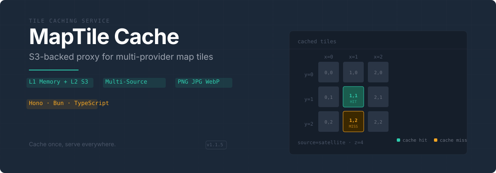

<p align="center">
  
</p>

## Overview

MapTile Cache sits between your application and map tile providers. It fetches tiles on first request, stores them in S3, and keeps hot tiles in an in-memory LRU cache for fast subsequent reads. Add new providers by editing a JSON file — no code changes required.

```
Your App → MapTile Cache → [L1 Memory] → [L2 S3] → Tile Provider
```

## Features

| | Feature | What it does |
|---|---|---|
| **L1/L2 Cache** | In-memory LRU (configurable size, TTL, byte limit) backed by S3 |
| **Multi-Source** | Serve satellite, terrain, dark, or custom tile sources from one endpoint |
| **Singleflight** | Deduplicates concurrent requests for the same tile — one upstream fetch per key |
| **Multi-Format** | Auto-detects PNG, JPEG, and WebP from file signatures |
| **Subdomain Rotation** | Distributes load across provider subdomains (`a.tile.example.com`, `b.tile.example.com`, …) |
| **Rate Limiting** | Built-in configurable rate limiter with sliding window |
| **Graceful Shutdown** | Drains in-flight requests before stopping (configurable timeout) |
| **Observability** | `/health` and `/metrics` endpoints with hit rate, latency, and cache stats |
| **Docker Ready** | Multi-stage Dockerfile, docker-compose, health checks, non-root user |

## Quick Start

```bash
# Clone and install
git clone https://github.com/Muromi-Rikka/maptile-cache.git
cd maptile-cache
bun install

# Start dev server (hot reload)
bun run dev
```

Fetch a tile:

```bash
curl "http://localhost:5000/tiles?source=satellite&z=3&x=4&y=2" --output tile.png
```

List available sources:

```bash
curl http://localhost:5000/maps
```

## API

### `GET /maps`

Returns all configured map sources.

```json
{
  "maps": {
    "satellite": { "name": "Satellite", "description": "Satellite imagery tiles" },
    "terrain": { "name": "Terrain", "description": "Terrain with hillshade" },
    "dark": { "name": "Dark Theme", "description": "Dark themed map tiles" }
  }
}
```

### `GET /tiles?source={source}&z={z}&x={x}&y={y}`

Fetches a single map tile. Returns the tile image with `X-Cache: HIT` or `X-Cache: MISS` header.

| Parameter | Type | Description |
|---|---|---|
| `source` | string | Map source identifier (e.g. `satellite`, `terrain`, `dark`) |
| `z` | number | Zoom level (≥ 0) |
| `x` | number | X coordinate |
| `y` | number | Y coordinate |

### `GET /health`

```json
{
  "status": "ok",
  "timestamp": "2024-01-01T00:00:00.000Z",
  "service": "maptile-cache",
  "version": "1.1.5",
  "availableSources": ["satellite", "terrain", "dark"]
}
```

### `GET /metrics`

Returns request counts, cache hit rate, average latency, and memory cache statistics.

## Configuration

### Map Sources

Define tile providers in `config/maps.json`:

```json
{
  "maps": {
    "your-source": {
      "name": "Display Name",
      "description": "Description of the map source",
      "urlTemplate": "https://example.com/{z}/{x}/{y}.png",
      "cachePrefix": "custom-prefix",
      "subdomains": ["a", "b", "c"],
      "timeout": 10000,
      "retryAttempts": 3,
      "headers": {
        "User-Agent": "Custom Agent"
      }
    }
  }
}
```

| Property | Type | Required | Description |
|---|---|---|---|
| `name` | string | ✅ | Display name |
| `description` | string | ✅ | Source description |
| `urlTemplate` | string | ✅ | URL with `{z}`, `{x}`, `{y}`, `{s}` placeholders |
| `cachePrefix` | string | ✅ | S3 key prefix for this source |
| `subdomains` | string[] | — | Subdomain list for `{s}` rotation |
| `timeout` | number | — | Request timeout in ms (default: 10000) |
| `retryAttempts` | number | — | Max retry attempts (default: 3) |
| `headers` | object | — | Additional HTTP headers |

### Environment Variables

#### S3 (Required)

| Variable | Description |
|---|---|
| `S3_ACCESS_KEY_ID` | S3 access key |
| `S3_SECRET_ACCESS_KEY` | S3 secret key |
| `S3_BUCKET` | S3 bucket name |
| `S3_ENDPOINT` | S3 endpoint URL |

#### Optional

| Variable | Default | Description |
|---|---|---|
| `S3_REGION` | `us-east-1` | S3 region |
| `S3_PREFIX` | `tiles` | S3 key prefix |
| `PORT` | `5000` | Server port |
| `LOG_LEVEL` | `info` | Logging level |
| `MEMORY_CACHE_MAX_SIZE` | `1000` | Max tiles in L1 memory cache |
| `MEMORY_CACHE_TTL_MS` | `300000` | L1 cache TTL (ms) |
| `MEMORY_CACHE_MAX_BYTES` | `268435456` | L1 cache byte limit (256 MB) |
| `RATE_LIMIT_WINDOW_MS` | `1000` | Rate limit window (ms) |
| `RATE_LIMIT_MAX` | `50` | Max requests per window |
| `SHUTDOWN_TIMEOUT_MS` | `15000` | Graceful shutdown timeout (ms) |
| `CORS_ORIGINS` | — | Comma-separated allowed origins |

### Cache Structure

Tiles are stored in S3 with this layout:

```
s3://bucket/
├── satellite/tiles/{z}/{x}/{y}.png
├── terrain/tiles/{z}/{x}/{y}.png
└── dark/tiles/{z}/{x}/{y}.png
```

The service caches the detected file extension per tile, so subsequent requests for the same tile skip extension probing.

## Deployment

### Docker Compose (Recommended)

```bash
# Create .env file
cat > .env << EOF
S3_ACCESS_KEY_ID=your-access-key
S3_SECRET_ACCESS_KEY=your-secret-key
S3_BUCKET=your-bucket-name
S3_ENDPOINT=https://your-s3-endpoint.com
S3_REGION=us-east-1
EOF

# Start
docker-compose up -d
```

### Docker CLI

```bash
docker build -t maptile-cache .
docker run -d \
  --name maptile-cache \
  -p 5000:5000 \
  -e S3_ACCESS_KEY_ID=your-key \
  -e S3_SECRET_ACCESS_KEY=your-secret \
  -e S3_BUCKET=your-bucket \
  -e S3_ENDPOINT=https://s3-endpoint.com \
  -e S3_REGION=us-east-1 \
  maptile-cache
```

## Development

```bash
bun run dev          # Dev server with hot reload
bun run start        # Production server
bun run build        # Build to dist/
bun test             # Run tests
bun run lint         # Lint
bun run type-check   # Type check
```

### Adding a New Map Source

1. Edit `config/maps.json` and add your source configuration
2. Restart the service
3. Access via `/tiles?source=your-source&z={z}&x={x}&y={y}`

No code changes needed — the service reads config at startup.

## Tech Stack

| Component | Technology |
|---|---|
| Runtime | [Bun](https://bun.sh) |
| Framework | [Hono](https://hono.dev) |
| Language | TypeScript |
| Storage | S3-compatible (via [s3-utils](https://github.com/nicepkg/s3-utils)) |
| Logging | [Pino](https://github.com/pinojs/pino) |
| Container | Docker |

## License

[Apache-2.0](LICENSE)
